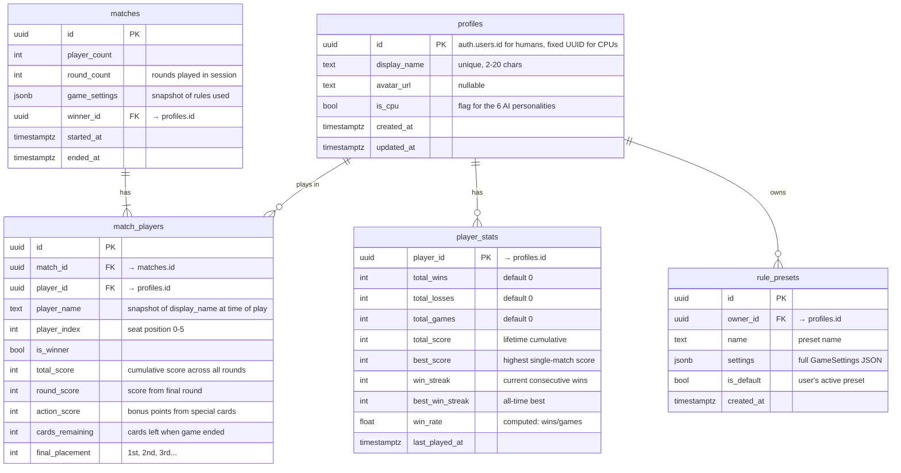

# Supabase Database Integration for UNO Blazor (Revised v3)

Add persistent storage via Supabase (PostgreSQL + Auth) so that player profiles, match history, win/loss records, and scores survive page refreshes and server restarts. Future deployment targets: **Vercel** (client) + **Render** (server).

## Status Tracker

- [x] **Phase 1: Supabase Setup & CPU Seeding**
- [x] **Phase 2: Client Project (`UnoApp`) — Auth & Services**
- [x] **Phase 3: Game Integration**
- [x] **Phase 4: New UI Pages**
- [x] **Phase 5: Admin Panel**
- [x] **Test Phase: Final Testing & Verification**
- [ ] **Phase 6: Email OTP Auth (Brevo)**

---

## Database Schema — 5 Tables



---

## Match-Save Architecture

> [!IMPORTANT]
> **Who saves match results?** Your current architecture is **host-authoritative on the client** — the `UnoApp.Server` (GameHub) is just a SignalR relay, it doesn't run game logic. So the **host client** (the Blazor WASM app running the `UnoGame` engine) is the one that knows the final scores.
>
> **Approach**: The host client calls the Supabase REST API directly (via the C# SDK) to insert into `matches` and `match_players`. Each non-host player also has a Supabase auth token (since they logged in independently), but only the host writes the match result. This keeps the server hub simple — no Supabase dependency on the Render server.

> [!WARNING]
> **Guest data loss**: Players who choose "Play as Guest" (anonymous auth) will lose their profile if they clear browser data or switch devices. Their stats will become orphaned. The Login page should make this clear and encourage account creation.

---

## Action Plan

### [DONE] Phase 1: Supabase Setup & CPU Seeding
- [x] Create Supabase project in the dashboard
- [x] Run the full SQL migration above in the SQL Editor
- [x] Enable anonymous auth in Authentication → Settings
- [x] Copy project URL + anon key into app config
- [x] Create Storage Bucket for avatars (5MB limit, public read)

---

### [DONE] Phase 2: Client Project (`UnoApp`) — Auth & Services
- [x] **[NEW] [Login.razor](file:///i:/1/UNO_Blazor/UnoApp/Pages/Login.razor)**: New landing page (default route `/`) with Guest and Auth options.
- [x] **[NEW] [SupabaseService.cs](file:///i:/1/UNO_Blazor/UnoApp/Services/SupabaseService.cs)**: Singleton wrapper around the Supabase C# client for Auth, Profiles, Match Saving, etc.
- [x] **[MODIFY] [Program.cs](file:///i:/1/UNO_Blazor/UnoApp/Program.cs)**: Add `supabase-csharp` NuGet package and register `SupabaseService`.
- [x] **[MODIFY] [App.razor](file:///i:/1/UNO_Blazor/UnoApp/App.razor)** & **[Home.razor](file:///i:/1/UNO_Blazor/UnoApp/Pages/Home.razor)**: Update routing so `/` goes to Login, and Home is moved to `/home`.

---

### [DONE] Phase 3: Game Integration

#### [DONE] [Models.cs](file:///i:/1/UNO_Blazor/UnoApp/UnoEngine/Models.cs)
- [x] `Player.Id` — currently `Guid.NewGuid()`. Changed to accept a Supabase profile UUID for humans and the fixed CPU UUIDs for bots
- [x] `Player.AvatarUrl` — already exists, populate from profile

#### [DONE] [Home.razor](file:///i:/1/UNO_Blazor/UnoApp/Pages/Home.razor)
- [x] On game over (MP only): call `SupabaseService.SaveMatchResult()` with all player data
- [x] Replace in-memory `LeaderboardEntry` list with local leaderboard sync
- [x] Load current user's rule presets from DB on page init
- [x] CPU players get assigned their fixed profile IDs + names + avatars from the seeded data

#### [DONE] [LobbyService.cs](file:///i:/1/UNO_Blazor/UnoApp/Services/LobbyService.cs)
- [x] `JoinRoomAsync` now also sends the player's Supabase UUID alongside their name

#### [DONE] [GameHub.cs](file:///i:/1/UNO_Blazor/UnoApp.Server/Hubs/GameHub.cs)
- [x] `JoinRoom` accepts an additional `playerId` (UUID string) parameter
- [x] Store `playerId` in `_connections` alongside room code and name
- [x] Broadcast player IDs to all players so the host knows everyone's Supabase UUID

#### [DONE] [MultiplayerModels.cs](file:///i:/1/UNO_Blazor/UnoApp/Multiplayer/MultiplayerModels.cs)
- [x] Add `string[] PlayerIds` to `GameStateDto` so the host can track Supabase UUIDs for match saving

---

### [DONE] Phase 4: New UI Pages

#### [DONE] PostgreSQL Trigger (Player Stats Automation)
- [x] Create a `SECURITY DEFINER` Postgres function to automatically aggregate wins, losses, streaks, and win rates upon match completion.
- [x] Attach an `AFTER INSERT` trigger on `match_players`.

<details>
<summary><b>Click to view the applied Trigger SQL</b></summary>

```sql
CREATE OR REPLACE FUNCTION public.update_player_stats()
RETURNS trigger
LANGUAGE plpgsql
SECURITY DEFINER
SET search_path = public
AS $$
BEGIN
  INSERT INTO public.player_stats (
    player_id, total_wins, total_losses, total_games, total_score, best_score, win_streak, best_win_streak, win_rate
  )
  VALUES (NEW.player_id, 0, 0, 0, 0, 0, 0, 0, 0)
  ON CONFLICT (player_id) DO NOTHING;

  UPDATE public.player_stats
  SET
    total_games = total_games + 1,
    total_wins = total_wins + CASE WHEN NEW.is_winner THEN 1 ELSE 0 END,
    total_losses = total_losses + CASE WHEN NOT NEW.is_winner THEN 1 ELSE 0 END,
    total_score = total_score + NEW.total_score,
    best_score = GREATEST(best_score, NEW.total_score),
    win_streak = CASE WHEN NEW.is_winner THEN win_streak + 1 ELSE 0 END,
    best_win_streak = GREATEST(best_win_streak, CASE WHEN NEW.is_winner THEN win_streak + 1 ELSE 0 END),
    last_played_at = NOW(),
    win_rate = ROUND(((total_wins + CASE WHEN NEW.is_winner THEN 1 ELSE 0 END)::numeric / (total_games + 1)::numeric) * 100, 2)
  WHERE player_id = NEW.player_id;

  RETURN NEW;
END;
$$;

CREATE TRIGGER on_match_player_insert
AFTER INSERT ON public.match_players
FOR EACH ROW
EXECUTE FUNCTION public.update_player_stats();
```
</details>

#### [DONE] Profile Page
- [x] Display name editing.
- [x] Avatar upload (Uploads to Supabase Storage).
- [x] Stats dashboard (wins/losses/win rate/streaks).
- [x] Match history timeline with scores.

> [!IMPORTANT]
> **Avatar Bucket Setup Required**: You must go into your Supabase Dashboard -> **Storage** and create a new public bucket named **`avatars`** (lowercase). Otherwise, the image upload will fail with a 404/403 error.

#### [DONE] Global Leaderboard Page
- [x] Top players by wins, win rate, total score.
- [x] Display AI badges for CPU players.
- [x] Replaced the lobby modal with a dedicated `/leaderboard` full-screen page.

> [!NOTE]
> The "Filterable by time period" requirement was dropped for now. Implementing this would require writing a custom PostgreSQL RPC function on the backend to aggregate matches dynamically by `created_at`, as `player_stats` only stores lifetime totals. We can revisit this later if desired!

---

### [DONE] Phase 5: Admin Panel (In-Game Dashboard)

#### [DONE] Supabase RLS Policies & Schema
- [x] Add an `is_admin` boolean to the `profiles` table.
- [x] Add an `is_banned` boolean to the `profiles` table.
- [x] Add an RLS policy to allow `is_admin = true` users to `UPDATE` any row in the `profiles` and `player_stats` tables (currently users can only update their own).

<details>
<summary><b>Click to view the applied SQL Query</b></summary>

```sql
-- 1. Create the fortified admin check function
CREATE OR REPLACE FUNCTION public.is_admin()
RETURNS boolean
LANGUAGE sql
SECURITY DEFINER
STABLE
SET search_path = public
AS $$
  SELECT COALESCE(
    (SELECT is_admin FROM public.profiles WHERE id = auth.uid()), 
    false
  );
$$;

-- 2. Policy: Admins can update any profile
CREATE POLICY "Admins can update any profile"
ON public.profiles
FOR UPDATE
USING ( public.is_admin() )
WITH CHECK ( public.is_admin() );

-- 3. Policy: Admins can update any player stats
CREATE POLICY "Admins can update any player stats"
ON public.player_stats
FOR UPDATE
USING ( public.is_admin() )
WITH CHECK ( public.is_admin() );
```
</details>

#### [DONE] Admin Account Setup Process
1. Run the app and go to the Login screen.
2. Click "Sign Up" to create your new account (or log into an existing one) as a normal player.
3. Log into your Supabase Dashboard on the web, go to the Table Editor, and find your row in the `profiles` table.
4. Manually flip the `is_admin` switch from `false` to `true`.
5. Now when you log into the app, you will have admin privileges!

#### [DONE] Admin Dashboard Page (`Admin.razor`)
- [x] **Access Control**: Page only loads if the logged-in user's `is_admin` is true. We will enforce this via `OnInitializedAsync`. If false, redirect to `/home`.
- [x] **Navigation**: Add a "⚙️ Admin Panel" button in `Home.razor` that only appears for admin users.
- [x] **C# SDK Methods**: Add new methods to `SupabaseService.cs`:
  - `GetAllProfiles()`: Fetches all registered users and CPU bots.
  - `GetAllStats()`: Fetches all rows from `player_stats`.
  - `UpdateProfileAdmin(profile)`: Updates a user's name, avatar, or `is_banned` status.
  - `UpdateStatsAdmin(stats)`: Modifies a user's wins/losses/score.
- [x] **User Management UI**: Build a glassmorphic dashboard (consistent with `Profile` and `Leaderboard`) listing all users. Include a search bar to easily find players.
- [x] **Edit Users & Manage CPUs**: Clicking a user opens an inline editor or modal to change their display name, avatar URL, or manually overwrite their stats (perfect for making the 6 CPU bots look intimidating!).
- [x] **Ban Users (Soft Delete)**: Add a bright red "BAN" toggle.
- [x] **Enforce Ban**: Add checks in `Home.razor` (when hitting "Host Game") and `Lobby.razor` (when joining a room) so that if `currentUser.IsBanned == true`, they are blocked from multiplayer lobbies with a clear error message.

---

### [DONE] Test Phase: Final Testing & Verification
Before declaring the project complete, we must manually verify all systems end-to-end.

#### [DONE] Test Scenarios
- [x] **Auth & Profiles**: Can a new user sign up? Does their default stats row generate upon playing? Can they upload an avatar and see it instantly?
- [x] **Admin Security**: Log in as a non-admin. Try to navigate directly to `/admin`. Does it redirect?
- [x] **Admin Gameplay**: Ensure that an admin account can play multiplayer games just like a normal player without any issues.
- [x] **Admin Powers**: Log in as an admin. Edit a CPU bot's name and stats. Verify it immediately reflects on the `/leaderboard`.
- [x] **Ban Enforcement**: As an admin, ban a test account. Log into the test account and attempt to host or join a multiplayer lobby. It must be blocked.
- [x] **Game Loop & Triggers**: Play a full game against CPU bots to completion. Ensure the host correctly saves the match, and the PostgreSQL trigger automatically increments wins, losses, games played, and updates the global leaderboard.

---

### [LEFT TO DO] Phase 6: Email OTP Auth (Brevo Integration)

The user wants to implement One-Time Password (OTP) email authentication for production. Supabase supports custom SMTP providers. Since the user wants a free, unlimited-ish tier for production, **Brevo** (formerly Sendinblue) is an excellent choice (300 emails/day for free).

#### Goals
- Guide the user on creating a Brevo account and obtaining SMTP credentials.
- Guide the user on configuring Supabase Authentication to use Brevo's SMTP server.
- Update `Login.razor` to support an "Email OTP" flow (Magic Link or 6-digit pin).
- Update `SupabaseService.cs` to add methods for `SignInWithOtp()` and `VerifyOtp()`.

#### UI Flow for OTP
1. User enters their email address and clicks "Send Code".
2. UI switches to a "Verification" state.
3. User checks their email, enters the 6-digit code (or clicks the magic link).
4. If code is valid, user is authenticated and redirected to `/home`.

> [!IMPORTANT]
> Since this involves setting up a 3rd party service (Brevo) and configuring the Supabase dashboard (which only the user has access to), the initial steps will involve step-by-step instructions for the user to follow in their browser.
